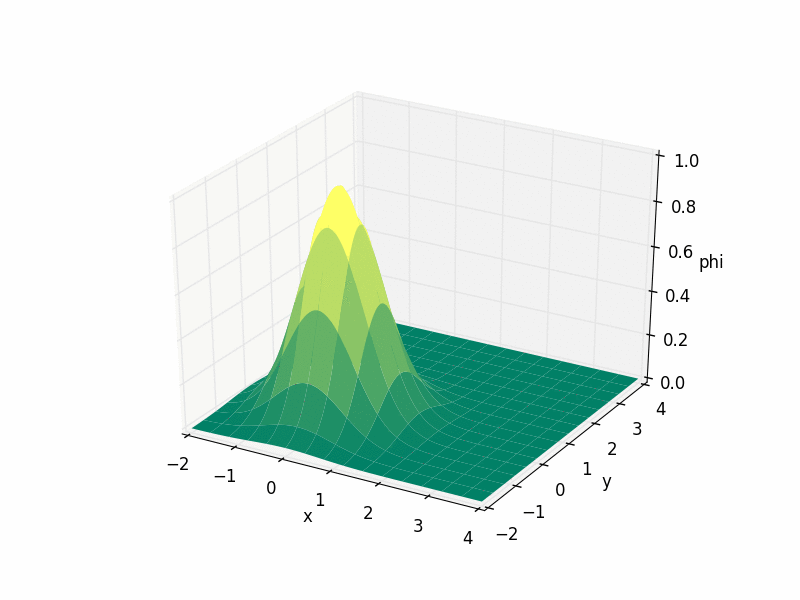
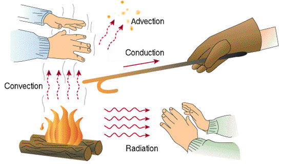
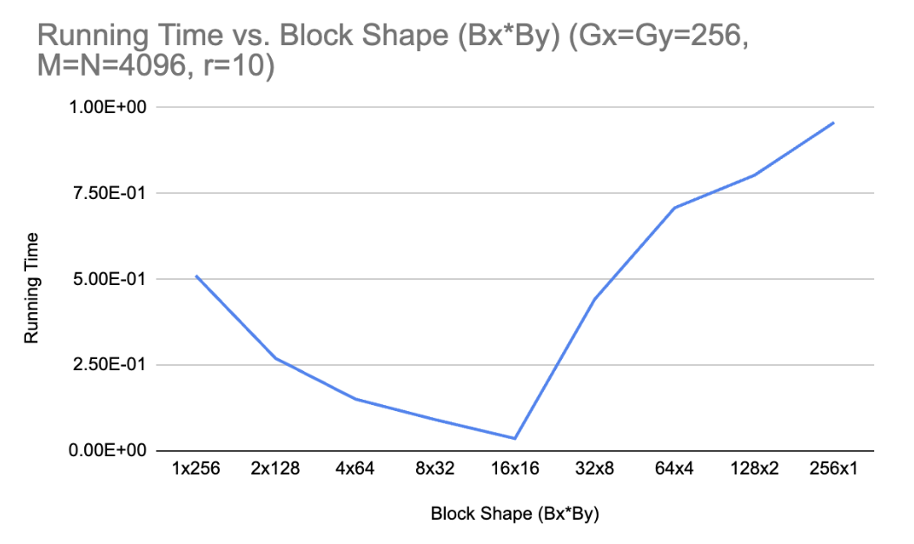
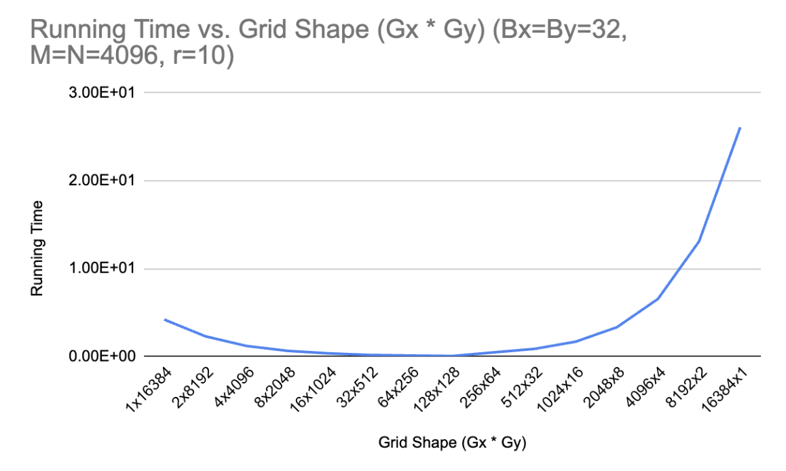
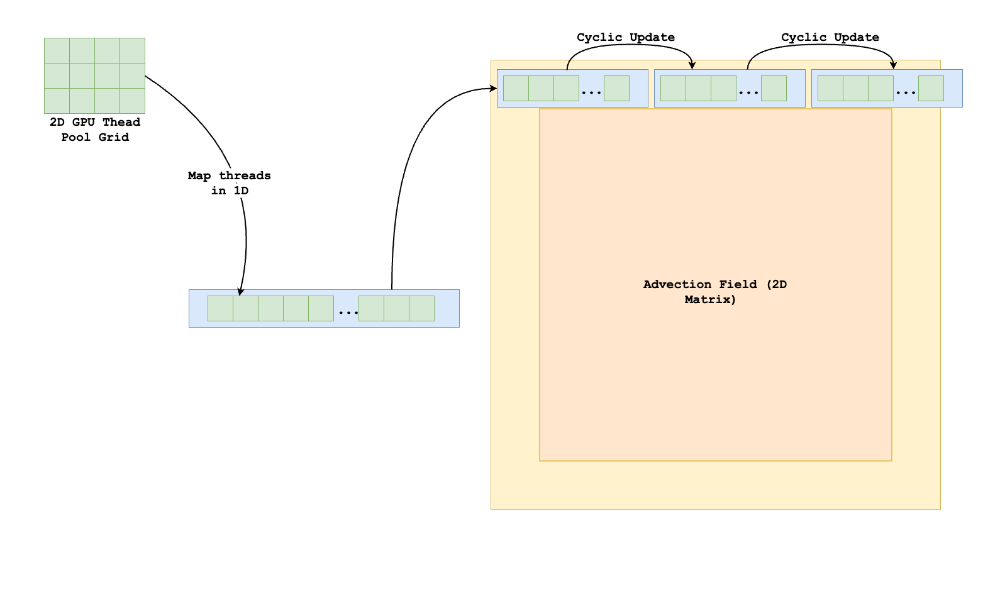

# Advection Solver with OpenMP and CUDA

An advection solver is a numerical algorithm used to simulate [advection](https://en.wikipedia.org/wiki/Advection), which is the transport of some quantity (like heat, smoke, pollutants, or fluid) through a physical medium due to bulk motion—such as wind or water flow.

The following images demonstrate the advection simulation in action:

<div align="center">
  <table>
    <tr>
      <td align="center">
        
        <br>
        <em>A simulation of the advection equation where u = (sin t, cos t) is solenoidal</em>
      </td>
      <td align="center">
        
        <br>
        <em>The four fundamental modes of heat transfer illustrated with a campfire</em>
      </td>
    </tr>
  </table>
</div>

This repository provides an implementation of an Advection Solver optimized for shared memory parallel programming models using OpenMP and CUDA. The goal is to facilitate understanding and experimenting with parallelization strategies on SMP (Symmetric Multiprocessing) and GPU architectures.

## Objectives

The project includes two primary directories:

- `openmp`: Contains an OpenMP implementation for CPU-based shared memory parallelization.
- `cuda`: Includes a CUDA-based implementation optimized for GPU acceleration.

Both directories contain:

- Test harness (testAdvect) to measure performance.
- Serial reference implementations for comparison.
- Template files to implement parallel algorithms.

## Setup

### Requirements

- GCC compiler with OpenMP support.
- CUDA Toolkit for GPU implementation.

### Compilation

Navigate to either `openmp` or `cuda` directory and run:
```bash
make
```

### Usage

#### OpenMP

```bash
OMP_NUM_THREADS=p ./testAdvect [-P P] [-x] M N [r]
```

- `-P P`: Optimize parallel execution over multiple timesteps using a P×Q block distribution (where p = PQ).
- `-x`: Enable additional optimizations.
- `M, N, r`: Simulation dimensions and optional repeat count.

#### CUDA

```bash
./testAdvect [-h] [-s] [-g Gx[,Gy]] [-b Bx[,By]] [-o] [-w w] [-d d] M N [r]
```

- `-h`: Run solver on CPU host.
- `-s`: Force serial execution on GPU.
- `-g Gx,Gy`: Set grid dimensions for GPU kernels.
- `-b Bx,By`: Set block dimensions for GPU kernels.
- `-o`: Activate optimized GPU implementation.
- `-d`: Select GPU device ID (useful for multi-GPU setups).

with default values of `Gx=Gy=Bx=By=r=1` and `v=w=d=0`. `Gx,Gy` specifies the grid dimensions of the GPU kernels; `Bx,By` specifies the block dimensions.

The option `-h` runs the solver on the host; this may be useful for debuggung and comparing the 'error' of the GPU runs. The option `-s` forces a serial implementation (run on a single GPU thread) and all other options are ignored. If neither of `-h,-s,-o` are given, `Gx,Gy` thread blocks of size `Bx,By` are used in a 2D GPU parallelization of the solver. 

The option `-d` can be used to specify the id of the GPU to be used. (For example you has 4 GPUs with id {0, 1, 2, 3}, so you can use `d` equal to either `0`, `1`, `2`, or `3`). This may be useful if a you are running on a cloud GPU server and particular GPU (e.g. GPU 0) is currently loaded.

## Tested Hardware

CPUs (suitable for OpenMP performance testing)

- Intel Core i7-12700KF (Local Machine)
- Intel Xeon (Cloud HPC Server)

GPUs (suitable for CUDA performance testing)

- NVIDIA GeForce RTX 2080 Ti (Local Machine)
- NVIDIA Tesla V100-SXM2-32GB (Cloud HPC Server)

## Key Features

OpenMP Implementation

- supports 1D and 2D domain decomposition.
- parallel region optimizations.
- performance modeling for shared memory.
- optional extended parallel region for efficiency.

CUDA Implementation

- load-balanced boundary updates using cyclic thread assignment [^1]
- static grid and block size tuning
- baseline and optimized kernel implementations
- performance exploration with different GPU configurations

## Performance Optimization

Performance tuning includes:

- cache efficiency via loop ordering
- minimizing synchronization overhead
- reducing cache misses (coherent reads/writes)
- kernel launch overhead management

The grid and block sizes can be adjusted to optimize performance for different GPU architectures.



[^1]: GPU threads are naturally 2D-indexed, but boundary updates (in `updateBoundaryNSKernel()` and `updateBoundaryEWKernel()`) operate in 1D. To better utilize threads, we map 2D thread indices to a 1D index and assign boundary updates cyclically across threads.

